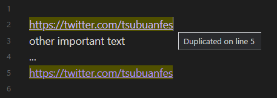

## Features

Highlights duplicate lines in the active open note. Hovering over a highlighted line will show a tooltip with the line number where it is duplicated.

Also, a notice is shown when pasting new lines that are already duplicates of existing lines in the file.

## Motivation

When using obsidian notes to keep track of items, such as web links. I often don't know if the item I'm about to add already exists, and end up duplicating the same item multiple times, this plugin helps prevent this.

## Possible future improvements:

- Detect duplicate links, instead of lines.
- Settings for excluding / including files and folders.
- Detect duplicates across different files (in-editor or in a dedicated view).
- Add command / shortcut to go to next occurrence of duplication.
